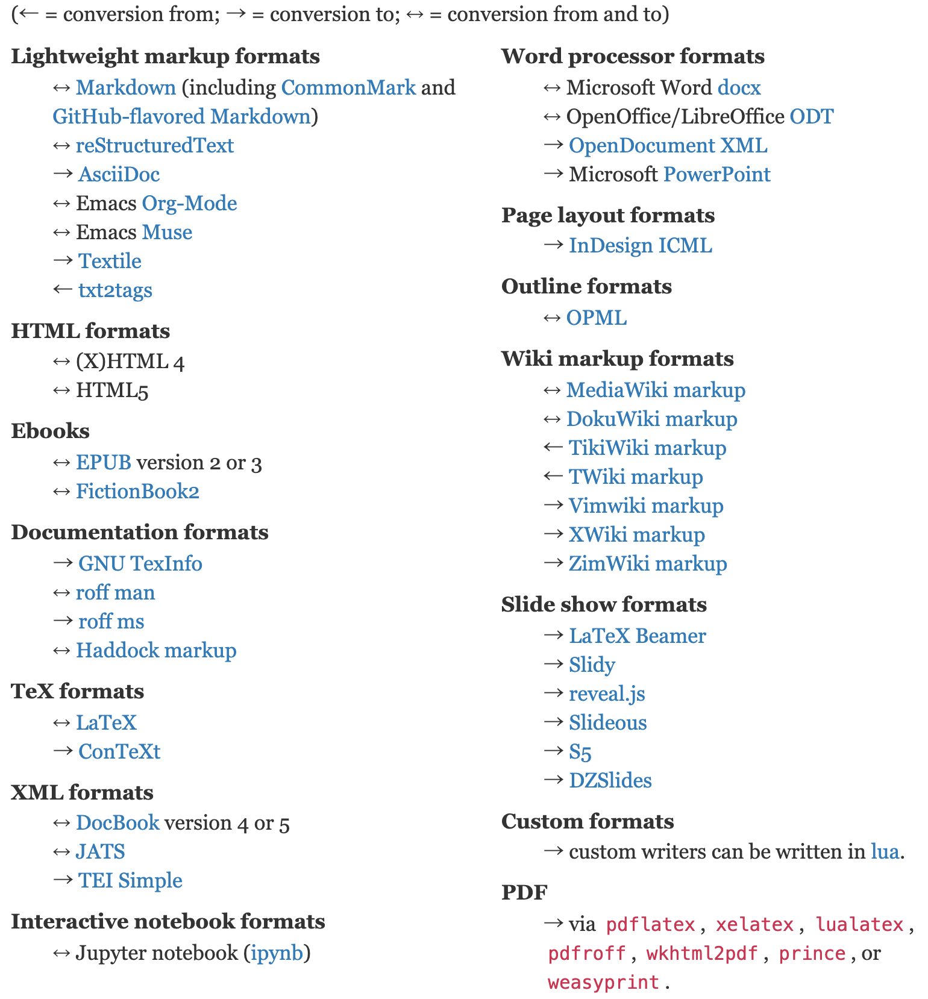

# 自己紹介

- 藤原 惟 (\@sky\_y)
- フリーエンジニア・ライター
- 著書『Markdownライティング入門』（インプレスR&D）
- 日本Pandocユーザ会 代表
    - Pandocユーザーズガイド翻訳（後述）
    - OSPN Pressに寄稿
    - 初のユーザイベント「Pandoc Night」開催（2019/5/20 @ 東京）

---

# 今日お話しする内容

- ドキュメント翻訳を支える技術
    - 目的：Pandoc User's Guide（英文）を翻訳しユーザが見られるようにする
    - いくつかの課題がある

---

# Pandocとは？

- a universal document converter
    - 万能文書変換器
    - 文書変換ツール
- ある文書（ドキュメント）を入力フォーマット $A$ から 出力フォーマット $B$ に変換する
    - コンテンツ（内容）とメタデータは**可能な限り**残す
    - スタイルはバッサリ捨てて、フォーマット $B$ に合わせる
- オープンソースソフトウェア (GPL v2 or later)

---

{.streach}

---

{.streach}

---

# 公式トップページ：例の図

<https://pandoc.org/>

{.stretch}

---

# トップページ：対応フォーマット一覧（最近できた）

{.stretch}

---

# 代表的な対応フォーマット

- 軽量/Wikiマークアップ言語
    - ↔︎ Markdown (GFM, CommonMarkなど各種方言に対応)
    - ↔︎ reStructuredTextなど
    - ↔︎ MediaWiki markup
- ↔︎ HTML, EPUB, LaTeX
- オフィス系
    - ↔︎ Microsoft Word docx
    - ↔︎ OpenOffice/LibreOffice ODT
- → スライド (LaTeX Beamer, reveal.jsなど)

---

# ここ最近で対応したフォーマット

```
→ Microsoft PowerPoint
↔ Jupyter notebook (ipynb)
→ Jira wiki markup
```

---

# Pandocユーザ会について

---

# Pandocユーザ会とは

- 今のところ任意団体のユーザ会です
- 目的
    - Pandocに関する情報共有・ヘルプ
    - Pandocが対応する**各種文書フォーマットを知り、そのユーザと交流する**
- ユーザ層はかなり多様です
    - LaTeX、Word、Sphinx、LibreOffice、Rなどなど
    - ITエンジニアだけでなく、編集者や非IT系エンジニア（電機系？）も

---

# Pandocユーザ会の活動拠点

- メーリングリスト
    - たまに更新、今後も使います
- Slack
    - アクティブですが、きちんと宣伝してませんでした :bow:
    - 参加希望の方は藤原まで話しかけてください！
- Webサイト
    - 長らく放置して申し訳ありません :bow:
    - ユーザーズガイド日本語版と同時にリニューアル（ベータ版で公開予定）

---


# Pandocユーザーズガイド 日本語訳の改訂作業

---

# 日本語訳 前のバージョン：1.12.4.2（超古い）

<http://sky-y.github.io/site-pandoc-jp/users-guide/>


---

# 日本語訳 改訂版：2.7+に対応予定

- <https://pandoc-doc-ja.readthedocs.io/ja/latest/users-guide.html>
    - robots.txtで検索避け中（まもなく公開予定）


---

# 前回の反省とこれからの課題

- 前回：1人で全部訳した
    - 持続可能でない (藤原が辛い)
    - 共同作業の仕組みがなかった
- gettextや翻訳メモリなど、翻訳ツールを使わなかった
    - テキストエディタ上で直接英文を和訳していた
    - 非効率的
- Pandocのバージョンが頻繁に上がる (1～3ヶ月に1度ぐらい)
    - User's Guide原文も頻繁に書き換わる
    - 和訳も素早く追随する必要がある

---

# 改訂版ユーザーズガイドのシステム構成

- GitHub: User's Guide原文 (jgm/pandoc)
- Pandoc: Markdown -> reStructuredText
- sphinx-intl: 翻訳ファイル生成 (pot/po)
- Transifex: Webアプリ (共同で翻訳作業)
- Sphinx: HTMLを生成
- Read the Docx: CI & ホスティング

---

<!-- TODO -->

---

# 最後に：翻訳者・レビュワー募集中！

- Slack または 藤原にお声がけください


---

# Pandocユーザ会Slackにお越しください！


<http://bit.ly/pandoc-jp>

---
